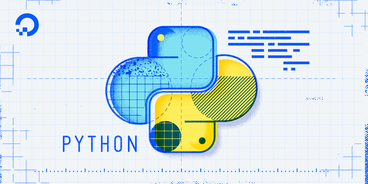

# Zen (Python) 

The Zen of Python, by Tim Peters

 
Beautiful is better than ugly. 
Explicit is better than implicit. 
Simple is better than complex. 
Complex is better than complicated. 
Flat is better than nested. 
Sparse is better than dense. 
Readability counts. 
Special cases aren't special enough to break the rules. 
Although practicality beats purity. 
Errors should never pass silently. 
Unless explicitly silenced. 
In the face of ambiguity, refuse the temptation to guess. 
There should be one-- and preferably only one --obvious way to do it. 
Although that way may not be obvious at first unless you're Dutch. 
Now is better than never. 
Although never is often better than *right* now. 
If the implementation is hard to explain, it's a bad idea. 
If the implementation is easy to explain, it may be a good idea. 
Namespaces are one honking great idea -- let's do more of those!

 Install Python3, pip3 and pycodestyle

- Pycodestyle is now the new standard of Python style code.

<pre>$ sudo apt-get install python3 python3-pip $ pip install pycodestyle</pre>

- Confirm you have the right version.

<pre>$ pycodestyle --version $</pre>

- Run it with file.

<pre>$ pycodestyle 3-print_number.py $</pre>

---

# 
Welcome to the Zen of Python🐍 programming language.😎🤗

### 
🌱 I’m learning Python Programming Language. With tasks from the ALX framework.

---
### 
🔭 And by extension, currently working on a task from one of the numerous ALX Projects I have, as you will see from the list below.😁

---

   

## About
- This repository consists of all the Python programming projects done🙂 in the [ ALX Africa](https://www.alxafrica.com/) Full stack Software Engineering course by [Ayomide Kayode](https://github.com/AyomideKayode).
- All `main.py` files are prewritten by the school. We (the students) build functions that produce a specific output while also taking into consideration edge cases.

## Resource

- [The Python Tutorial](https://docs.python.org/3/tutorial/index.html)
- [Learn to Program](https://www.youtube.com/playlist?list=PLGLfVvz_LVvTn3cK5e6LjhgGiSeVlIRwt)
- [The Python Handbook](https://www.freecodecamp.org/news/the-python-handbook/)
- [pycodestyle](https://pypi.org/project/pycodestyle/)

---

## Projects
- [0x00](./0x00-python-hello_world) : Hello, World.
- [0x01](./0x01-python-if_else_loops_functions) : if/else, loops, functions.
- [0x02](./0x02-python-import_modules) : import & modules.
- [0x03](./0x03-python-data_structures/) : Data Structures: Lists, Tuples
- [0x04](./0x04-python-more_data_structures/) : More Data Structures: Set, Dictionary
- [0x05](./0x05-python-exceptions/) : Exceptions
- [0x06](./0x06-python-classes/) : Classes and Objects
